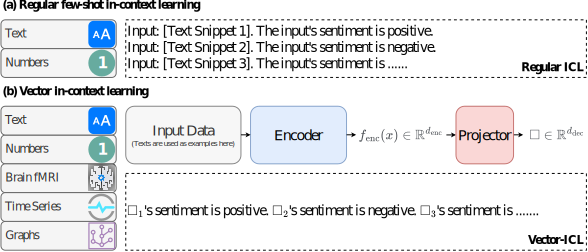
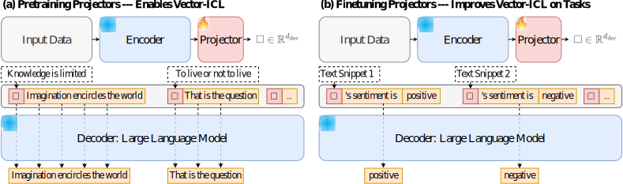
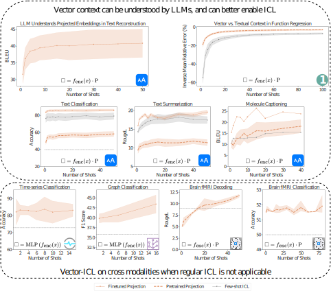

<h1 align="center"> ↖️ Vector-ICL ↗️ </h1>
<p align="center"> <b>Vector-ICL: In-context Learning with Continuous Vector Representations</b>  (<a href="https://arxiv.org/abs/2410.05629">Zhuang et al., ICLR 2025</a>). 
</p>

<p align="center">
  
  
</p>  

<p align="center"> Vector-ICL is a way of conducting in-context learning with data of any forms. <br>
<strong>1. Encode data into embedding vector</strong><br>
<strong>2. Project the vector into LLMs' representation space</strong><br>
<strong>3. Build the context with the projected embeddings</strong>
</p>


<p align="center">
  
</p>  

<p align="center">
And we only need to train a light-weight projector (a linear matrix works most of the time!). <br>
(a) Pretraining with next token prediction (such as language modelling objective) enables Vector-ICL, <br>
(b) task finetunes further improves LLMs' ability to conduct Vector-ICL.
</p>

<p align="center">
  
</p>  

<p align="center">
We show that Vector-ICL works for a wide range of modalities and tasks, surpassing few-shot ICL and domain-specific models and tunings. <br>

</p>  

## Example Usage

We show examples of using Vector-ICL at text-based tasks over here:

| Example    | Script |
| -------- | ------- |
| Pretraining Projector  | [example script](examples/example_scripts/text_pretrain.sh)    |
| Fituning Projector | [example script](examples/example_scripts/text_finetune.sh)     |
| Evaluating text classification  | [example script](examples/example_scripts/text_inference_classification.sh) |
| Evaluating text generation  | [example script](examples/example_scripts/text_inference_generations.sh) |
| Evaluating ICL Baselines  | [example script](examples/example_scripts/text_inference_baseline.sh) |

For cross-modal Vector-ICL, the scripts are provided in this [folder](examples/example_scripts) with training and inferencing pipelines.

## Questions?

If you have any questions related to the code or the paper, feel free to reach out to us at y5zhuang@ucsd.edu.


## Citation

If you find our paper and code useful, please cite us:
```r
@article{zhuang2024vector,
  title={Vector-ICL: In-context Learning with Continuous Vector Representations},
  author={Zhuang, Yufan and Singh, Chandan and Liu, Liyuan and Shang, Jingbo and Gao, Jianfeng},
  journal={arXiv preprint arXiv:2410.05629},
  year={2024}
}
```